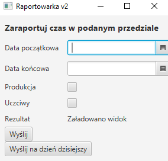

Mini aplikacja służąca do export workloga z aplikacji [toogl](https://toggl.com/) do [jiry](jira.credential.url)

Pierwsze uruchomienie: 
1. Należy odpowiednio zdefiniować propertisy w pliku [defaults.properties](src/main/resources/default.v1.properties). 
2. W wierszu poleceń wpisujemy `mvn clean package` i powstaje nam *.jar
3. Powinno pojawić się okno podobne do

